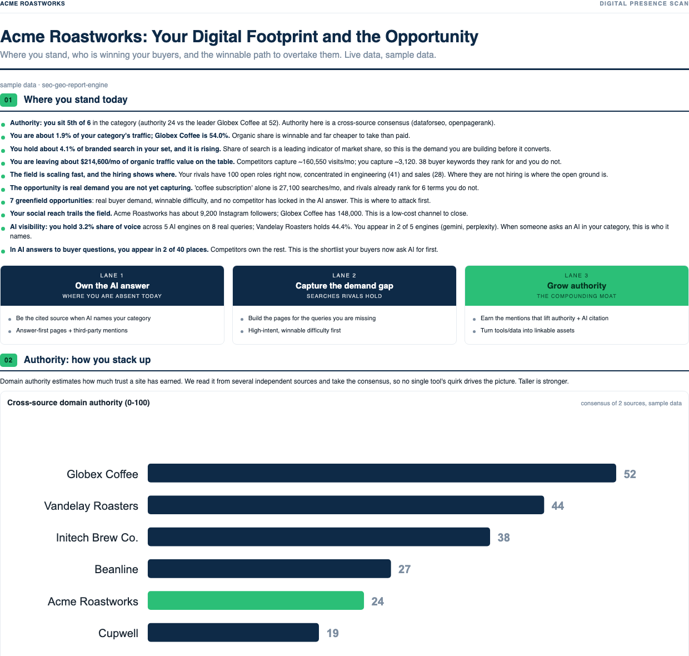
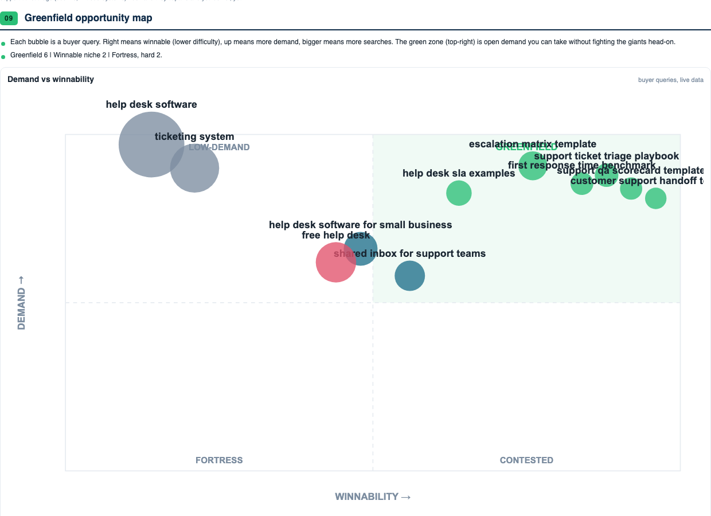
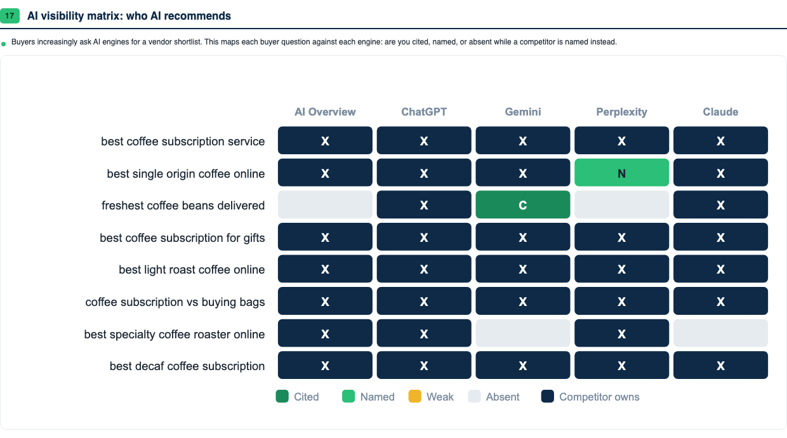

# seo-geo-report-engine

An open-source **SEO and AI-search (GEO) report engine** that runs inside
[Claude Code](https://claude.com/claude-code) and any harness that can run Python. Point it at a
company and it scans the field with live data, then renders a branded, 18-section competitive
report as a PDF. AI visibility across five engines, backlink and keyword gaps, traffic share,
reputation, ads footprint, social reach, Core Web Vitals, and the plan to take the open ground.

**See it before you install anything.**
[Sample report 1](docs/assets/sample-report-1.pdf) (consumer brand) ·
[Sample report 2](docs/assets/sample-report-2.pdf) (B2B SaaS). Both were produced entirely from
the fictional demo clients that ship with this repo. The full capability list, every report
section, skill and workflow, lives on the
[capabilities page](https://geoseo-visibility.prashish.xyz/capabilities.html).







## Why this exists

Most AI-visibility and SEO-audit tools are closed dashboards. This is the opposite, a
transparent, scriptable engine you own. Every number in a report traces to a live API call you
made with your own keys, every recommendation is falsifiable, and the whole thing is stdlib-only
Python. Nothing to pip install, no build step, no lock-in.

## Quickstart, zero API keys

Free to download and run. The demo report costs nothing and needs no accounts.

```bash
git clone https://github.com/prashishh/seo-geo-report-engine.git
cd seo-geo-report-engine
bash scripts/doctor.sh                 # verifies Python 3.8+ and headless Chrome for PDFs

# render the full demo report from the fictional client that ships with the repo
python3 tools/report/first_scan.py --project demo --date "sample data" --render
open projects/demo/deliverables/demo-first-scan.pdf

# the second demo shows the same report on a B2B vertical
python3 tools/report/first_scan.py --project demo-b2b --date "sample data" --render

# and the live internal dashboard
./bin/mkt dashboard serve              # -> http://127.0.0.1:8787
```

Everything in `projects/demo/` and `projects/demo-b2b/` is fictional. Companies like
"Globex Coffee" and "Contoso Helpdesk" on the reserved `.example` TLD, so the full pipeline
demonstrates itself without spending a cent.

## Running a real scan

Copy `config/secrets.example.env` to `config/secrets.env` and add keys. Everything is pay as you
go. A full first-scan of a client plus ~8 competitors costs **$1 to $2 of API credit**.

| Key | Powers | Cost | Required? |
|---|---|---|---|
| `DATAFORSEO_LOGIN/PASSWORD` | keywords, SERPs, traffic, backlinks, AI-visibility matrix, Lighthouse CWV, Google Business ratings, Ads Transparency, Trends | PAYG, $1 to $2 per full scan | **Yes**, the backbone |
| `OPENROUTER_API_KEY` | reputation themes, ad-messaging teardown, cited deep research | ~$0.005 per probe | Recommended |
| `APIFY_API_TOKEN` | social following and public profile data | free tier works | Optional |
| `PREDICTLEADS_API_KEY/TOKEN` | competitor funding and hiring momentum | free tier works | Optional |
| `OPENPAGERANK_API_KEY` | authority cross-check | free | Optional |
| `MOZ_TOKEN`, `AHREFS_API_KEY` | extra authority sources for consensus scoring | their plans | Optional |

Then run the end-to-end pipeline for a prospect (the full step list lives in
[commands/client-report.md](commands/client-report.md)), or launch Claude Code in this folder and
say *"run a first-scan report for example.com"*. The skills route themselves.

## What it produces

- **The first-scan pitch report**, the flagship. Authority, backlink and link-gap, traffic
  share, share of search, funding and hiring momentum, keyword and greenfield maps, reputation
  wedge, Google Ads read, social benchmark, Core Web Vitals, and an AI-visibility matrix across
  ChatGPT, Gemini, Claude, Perplexity and Google AI Overviews. Every section auto-includes only
  when its data exists.
- **Growth proposals** and **weekly or monthly client reports** as branded PDFs. Pure-SVG charts
  and print-quality rendering make the decks look designed, not generated.
- **Programmatic and comparison pages**, content briefs, keyword maps, technical audits.
- **A live internal dashboard** over every project's latest data.

## For AI agents

Working inside Claude Code, Codex, or another agent harness? Read [CLAUDE.md](CLAUDE.md) for
routing. The skills register automatically, every tool is plain stdlib Python with flags an agent
can call directly, and a machine-readable summary lives at
[docs/llms.txt](docs/llms.txt).

## Two ways to run it

**Repo mode.** Launch Claude Code in this folder. `.claude/` symlinks expose all skills,
commands, and agents. Reference a client with `--project <slug>` or `MKT_PROJECT=<slug>`.

**Plugin mode.** Install as a Claude Code plugin and use the skills from any directory.

```text
/plugin marketplace add <path-or-git-url of this repo>
/plugin install seo-geo-report-engine@seo-geo-report-engine
```

## Layout

```
CLAUDE.md            operating manual + routing (read this first)
skills/<name>/       33 capabilities the model auto-invokes
commands/<name>.md   slash-command workflows (/client-report, /discovery-audit, ...)
agents/<name>.md     specialist subagents (seo / geo / content / data / report)
tools/               stdlib-only Python; run via ./bin/mkt or python3 directly
  connectors/          DataForSEO, OpenRouter, Apify, PredictLeads, Ahrefs, PageSpeed
  seo/  geo/  report/  the scan tools + report assemblers
  charts/  pdf/        pure-SVG chart kit + HTML-to-PDF rendering
templates/           proposal and report schemas, client.yml.example
playbooks/           the methodology each skill encodes, readable on its own
knowledge/           provider landscape, AI-crawler list, report roadmap
projects/demo*/      the two fictional demo clients (the only projects that ship)
projects/<slug>/     your real clients. Gitignored, stays on your machine
```

## Capabilities at a glance

The detailed list with one-line descriptions is on the
[capabilities page](https://geoseo-visibility.prashish.xyz/capabilities.html).

- **GEO / AI search** · `llm-visibility` (5-engine matrix) · `geo-audit` · `aeo-content-patterns` ·
  `ai-citation-sprint` · `serp-intel` (AI Overviews) · `web-research` (cited live research)
- **SEO** · `keyword-research` · `competitor-analysis` · `backlink-analysis` · `technical-seo-audit` ·
  `programmatic-seo` · `comparison-pages` · `content-brief` · `content-refresh` · `internal-linking` ·
  `schema-markup` · `local-seo` · `hreflang-i18n` · `rank-tracking` · `web-vitals` · `domain-authority`
- **GTM / strategy** · `positioning-messaging` · `customer-research` · `market-opportunity` ·
  `opportunity-map` · `first-scan-report` · `proposal-builder`
- **Ops** · `report-generator` · `kpi-dashboard` · `agency-dashboard` · `skill-navigator` (the router)

**Workflows** · `/client-report` · `/new-client` · `/discovery-audit` · `/growth-plan` ·
`/growth-proposal` · `/competitor-watch` · `/weekly-report` · `/monthly-report`

## Principles

- **Stdlib-only tools.** No dependencies to install, ever. Runs the same in Claude Code, Codex, or cron.
- **Config as data.** One thin tool per report section writes a JSON artifact, and the report
  auto-includes any section whose artifact exists. A partial scan still renders.
- **Falsifiable recommendations.** Every claim states the observation, the dependency, and how you
  would know it failed.
- **Honest by design.** Sections hide rather than show unverified data, review counts come only
  from verified listings, namesake contamination is filtered, and estimates are labeled estimates.

## Support

Provided as-is under the [MIT license](LICENSE). It is used in production for real client work
and fixes land as we need them. Issues and PRs are welcome, without a support SLA. If you would
rather have this run *for* you, email your website to namaste@prashish.xyz and the first
scan comes back as soon as possible.
